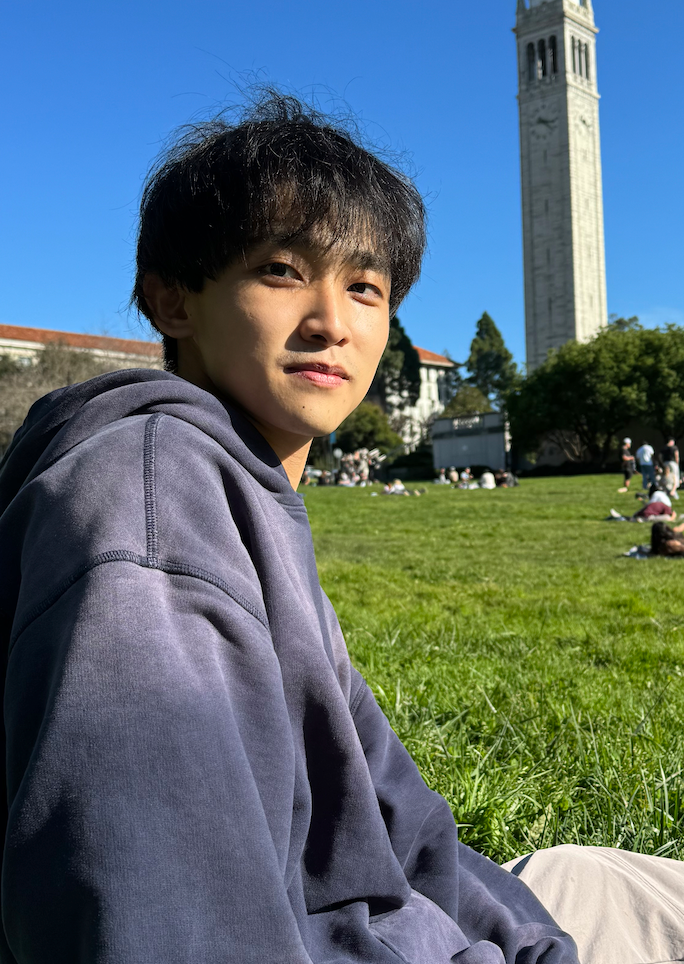

Visit the [PI page](pi.md) for details about the Principal Investigator.

### PhD Students
::: {.member-grid}
::: {.member-card}
{.member-avatar alt="Quanhao Yu"}
Quanhao Yu

PhD Student · interested in reward process

:::
::: {.member-card}
{.member-avatar alt="Xinyuan Zhang"}
Xinyuan Zhang

PhD Student · interested in mechanism of addiction and neuromodulation

:::
::: {.member-card}
{.member-avatar alt="Yihan Yan"}
Yihan Yan

PhD Student · interested in large-scale brain network analysis

:::
::: {.member-card}
{.member-avatar alt="Mengting (Vicky) Shen"}
Mengting (Vicky) Shen

PhD Student

:::
::: {.member-card}
{.member-avatar alt="Xinyi (Kathryn) Zhou"}
Xinyi (Kathryn) Zhou

PhD Student

:::
:::

### Master Students
::: {.member-grid}
::: {.member-card}
{.member-avatar alt="Yutong Li"}
Yutong Li

Master Student · interested in computational psychiatry

:::
::: {.member-card}
{.member-avatar alt="Keyi Zhang"}
Keyi Zhang

Master Student · interested in time perception

:::
::: {.member-card}
{.member-avatar alt="Yuqiao Cai"}
Yuqiao Cai

Master Student

:::
:::

### Research Assistants / Technicians
<!-- Add members here using the same card template -->

### Interns
<!-- Add members here using the same card template -->

### Alumni
::: {.member-grid}
::: {.member-card}
{.member-avatar alt="Zhenhua Cui"}
Zhenhua Cui

Alumni · former Research Assistant; now postgraduate student in psychology and neuroscience at KCL

:::
:::
