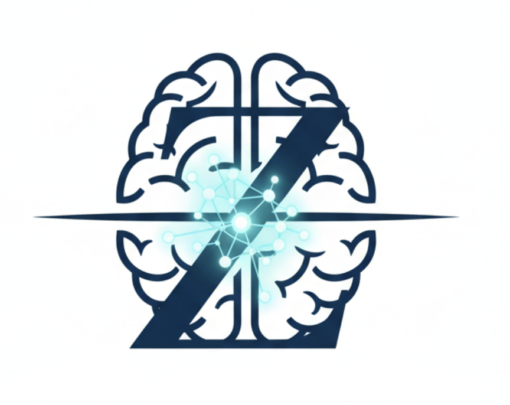

# Zhao Lab | Mental Spectrum Research Group

## RESEARCH INTERESTS

### Research Focus:  
#### Cognitive Mechanisms and Connectome-Guided Interventions
Our laboratory is dedicated to investigating the cognitive neural mechanisms underlying psychiatric and addictive behaviors, with a strong commitment to clinical translation across the lifespan. We focus on key underlying dimensions, including the neural circuitry of time perception, reward processing, and decision-making, providing the foundational understanding necessary to tackle complex psychopathology. A specific area of emphasis is developmental psychopathology in adolescents, where we study neurodevelopmental trajectories of risk and resilience to pioneer early interventions for critical issues like emotion dysregulation and substance use comorbidity.

### Methodology: 
#### Advanced Decoding and AI-Driven Modeling
Our methodology is defined by rigorous data science and circuit-level precision. To advance our mechanistic understanding, we employ advanced decoding techniques for multimodal neuro-signals (e.g., SEEG, EEG, MEG, fMRI) and leverage AI Large Language Models (LLMs) and Large Multimodal Models (LMMs) to build sophisticated models of brain function. This approach allows us to move beyond correlation to establish causal links between specific neural patterns and behavior, forming the basis for biomarker-driven therapeutic strategies (e.g., TMS, tES, Ti). We are committed to translating complex data into actionable insights for the clinical populations.

### Translational Goal: 
#### Circuit-Targeted Neuromodulation
Ultimately, our research aims to achieve highly effective and targeted therapeutic intervention. We employ exogenous neuro-modulation methods, including Closed-loop Non-Invasive Brain Stimulation (NIBS), to functionally reconstruct abnormal neural circuits. This includes sophisticated circuit-targeted neuromodulation in both clinical and aging populations, focusing on areas like cognitive augmentation through prefrontal-striatal pathway modulation. By linking precise biomarker identification with closed-loop intervention, we strive to establish a new paradigm for treating addictive behaviors and other psychiatric disorders.

[Learn More About Us](people.html)  
[Join us](contact.html)

