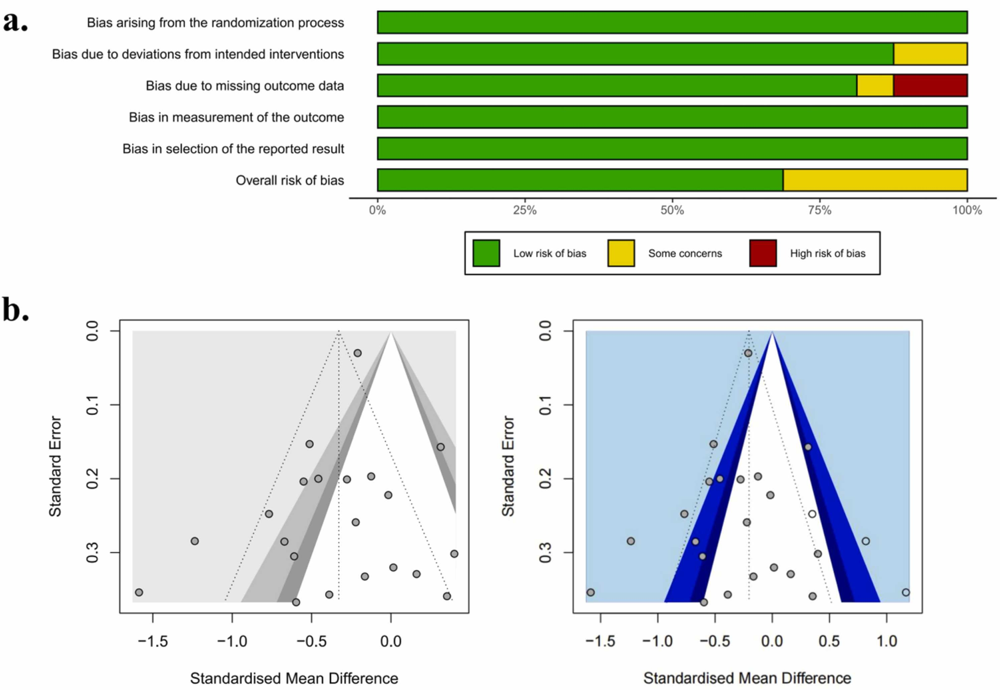
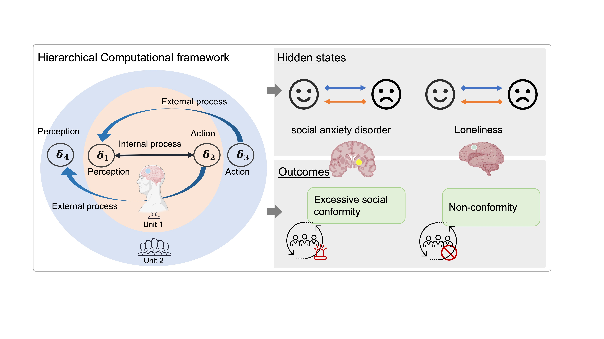
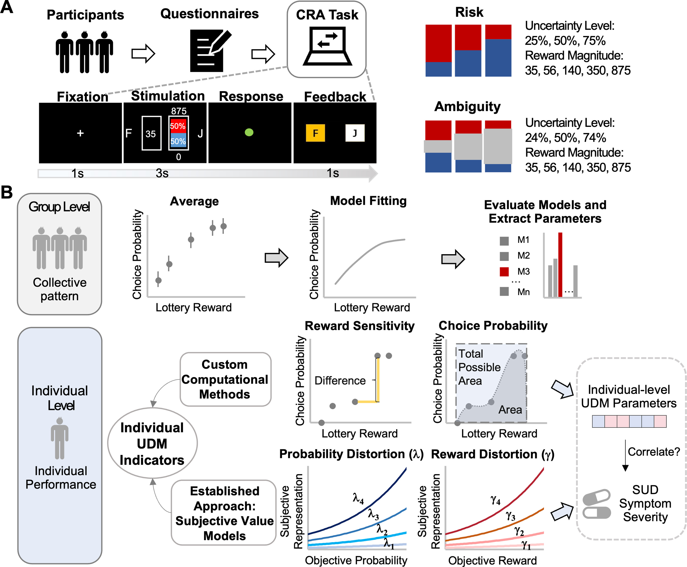
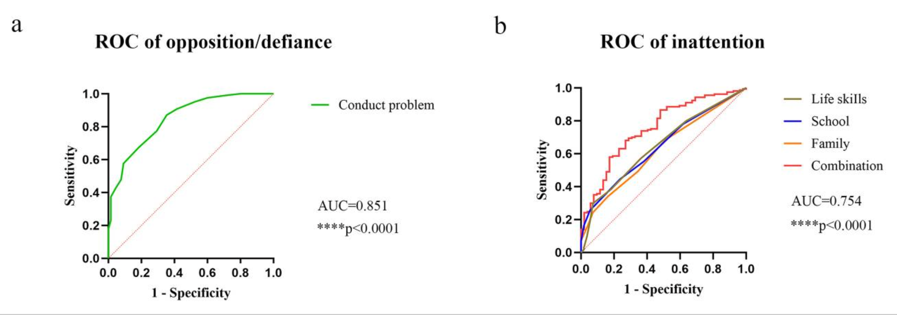
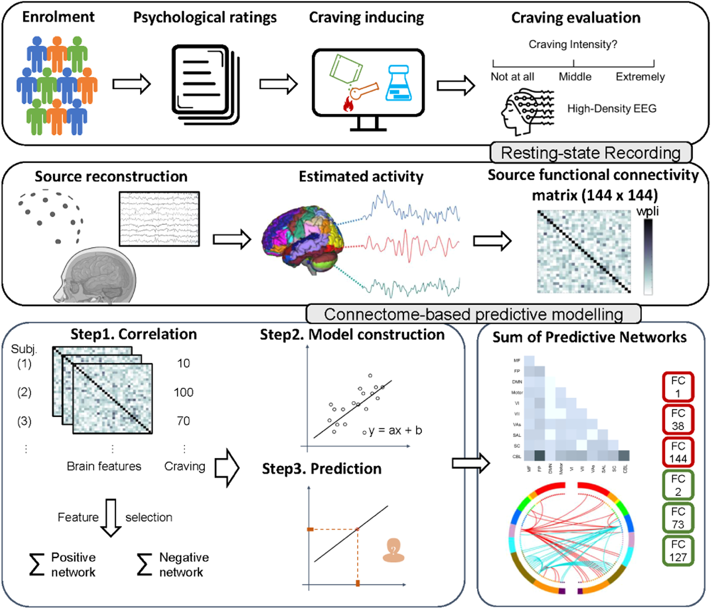

::: {.news-list}
::: {.news-item}
{.news-thumb alt="News image 1" style="width:240px; float:right; margin:0 0 1rem 1rem"}
Publication  
News: Our latest meta-analysis published in Neuroscience & Biobehavioral Reviews in reveals that non-invasive brain stimulation reduces both suicidal ideation and depressive symptoms. Across 21 trials, synergistic effects and cultural influences emerged, highlighting NIBS as a promising, culturally sensitive intervention for depression and suicide prevention.  
[Read paper](https://doi.org/10.1016/j.neubiorev.2025.106299){.btn .btn-sm .btn-primary target="_blank" rel="noopener"}
:::

::: {.news-item}
{.news-thumb alt="News image 2" style="width:240px; float:right; margin:0 0 1rem 1rem"}
Publication  
News: Our new study published in Biological Psychiatry reveals overlapping neural circuits between social conformity and psychiatric disorders. Using a hierarchical computational framework, we show how aberrant neurobiology shapes conformity, offering new targets for individualized interventions such as pharmacotherapy and neurostimulation.  
[Read paper](https://doi.org/10.1016/j.biopsych.2025.05.011){.btn .btn-sm .btn-primary target="_blank" rel="noopener"}
:::

::: {.news-item}
{.news-thumb alt="News image 3" style="width:240px; float:right; margin:0 0 1rem 1rem"}
Publication  
News: Our latest behavioral modeling study published in Biological Psychiatry-Cognitive Neuroscience and Neuroimaging reveals distinct uncertainty decision-making profiles across substance use disorders. Methamphetamine users show heightened reward sensitivity and flexible ambiguity responses, unlike alcohol users, highlighting disorder-specific mechanisms and the need for precision-targeted interventions.  
[Read paper](https://doi.org/10.1016/j.bpsc.2025.08.008){.btn .btn-sm .btn-primary target="_blank" rel="noopener"}
:::

::: {.news-item}
{.news-thumb alt="News image 4" style="width:240px; float:right; margin:0 0 1rem 1rem"}
Publication  
News: Our new clinical study published in General Psychiatry reveals that adverse home environments significantly exacerbate ADHD core symptoms and oppositional behaviors. These findings highlight the need for early, tailored interventions addressing family dynamics to mitigate behavioral risks in untreated children.  
[Read paper](https://pubmed.ncbi.nlm.nih.gov/?term=Association+between+adverse+home+environments+and+symptoms+in+drug-naive+children+with+attention-deficit%2Fhyperactivity+disorder){.btn .btn-sm .btn-primary target="_blank" rel="noopener"}
:::

::: {.news-item}
{.news-thumb alt="News image 5" style="width:240px; float:right; margin:0 0 1rem 1rem"}
Publication  
News: Our latest connectomic analysis published in International Journal of Clinical and Health Psychology identifies a craving-specific EEG network predicting methamphetamine craving. This beta-band connectome links abstinence duration, impulsivity, and cue-induced craving, highlighting novel neural targets for precision interventions in methamphetamine use disorder.  
[Read paper](https://doi.org/10.1016/j.ijchp.2025.100551){.btn .btn-sm .btn-primary target="_blank" rel="noopener"}
:::
:::
