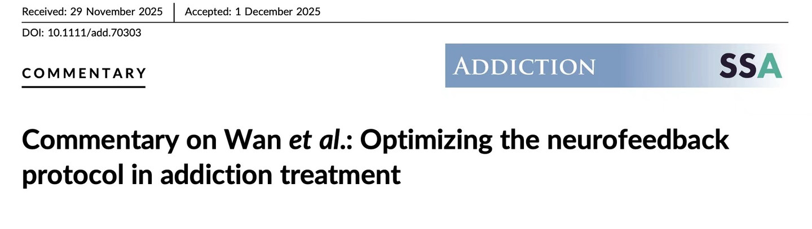
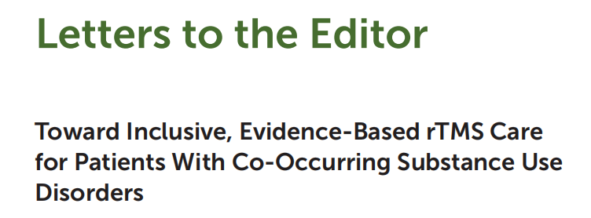
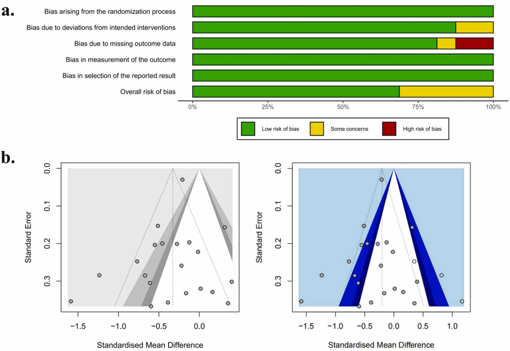
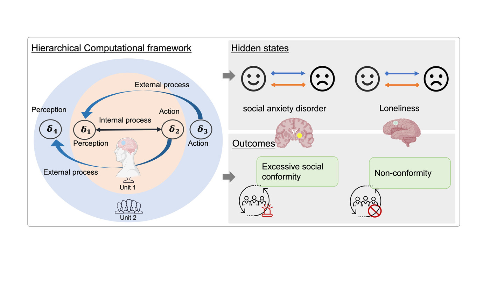
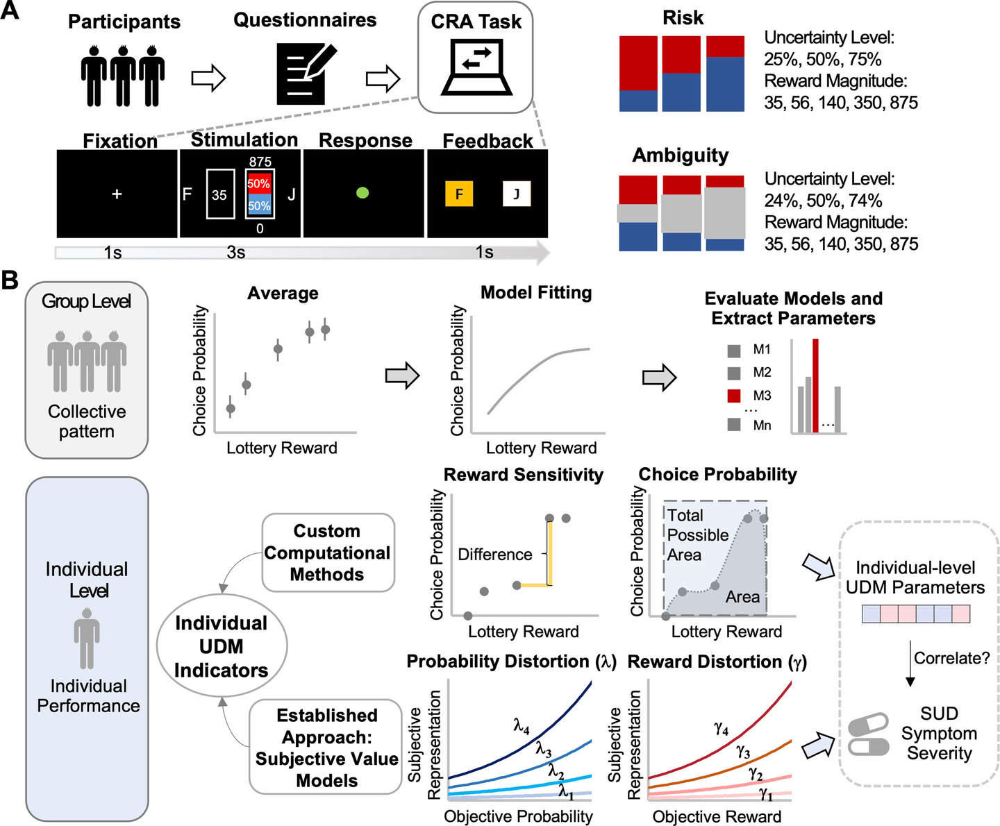
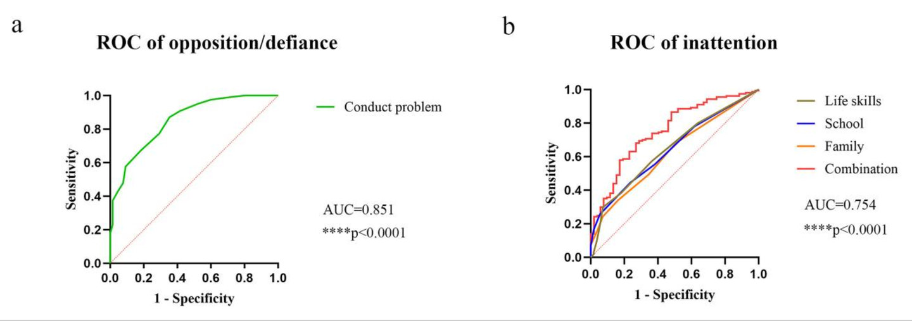
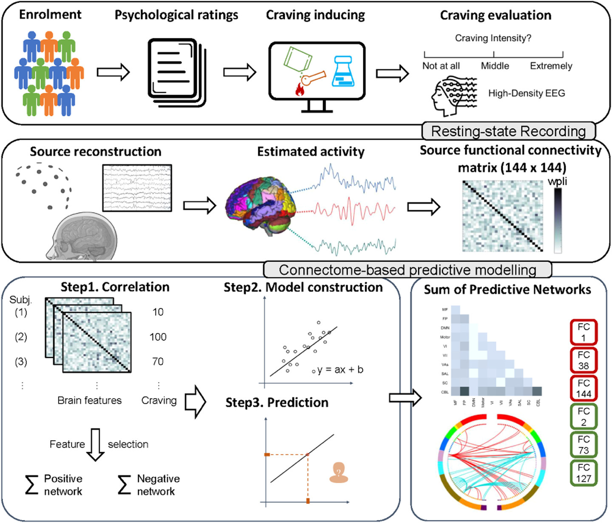

::: {.news-list}
::: {.news-item}
{.news-thumb alt="Addiction Commentary News"}

::: {.badge .date #month-2025-12}
2025-12
:::

Publication  
**News: Our laboratory published an invited commentary in Addiction entitled “Commentary on Wan et al.: Optimizing the Neurofeedback Protocol in Addiction Treatment.”**

December 17, 2025, Our laboratory published an invited commentary in Addiction entitled “Commentary on Wan et al.: Optimizing the Neurofeedback Protocol in Addiction Treatment.” The article discusses why the therapeutic efficacy of EEG-based neurofeedback in addiction remains inconsistent, highlighting a mechanistic mismatch and substantial methodological heterogeneity across studies. Building on the recent systematic review and meta-analysis by Wan and colleagues, the commentary emphasizes the need to shift from demonstrating general efficacy toward mechanism-driven protocol design and standardized reporting (CRED-nf) to identify effective parameters and specific patient subgroups, thereby enabling more reliable clinical applications of neurofeedback.  
[Read paper](https://doi.org/10.1111/add.70303){.btn .btn-sm .btn-primary target="_blank" rel="noopener"}
:::

::: {.news-item}
{.news-thumb alt="AJP Commentary News"}

::: {.badge .date #month-2025-12}
2025-12
:::

Publication  
**News: Our Laboratory and International Collaborators Publish Commentary in American Journal of Psychiatry Calling for Inclusive, Evidence-Based rTMS Guidelines in Substance Use Disorders**

December 1, 2025, Prof. Zhao together with international collaborators, have co-authored the paper “Toward Inclusive, Evidence-Based rTMS Care for Patients With Co-Occurring Substance Use Disorders” in the American Journal of Psychiatry. The piece responds to the recently published Delphi consensus on rTMS use in patients with concurrent substance use, recognizing the importance of the topic while noting significant methodological limitations. The authors highlight that a substantial body of evidence supports the safe and effective use of rTMS in individuals with co-occurring substance use disorders. They call for future guidelines to adopt rigorous evidence evaluation, reduce stigma-driven restrictions, and better reflect the realities of psychiatric comorbidity. This collaborative effort underscores the field’s need for more inclusive, data-driven clinical recommendations that expand equitable access to care and strengthen research pathways.  
[Read paper](https://doi.org/10.1176/appi.ajp.20250407){.btn .btn-sm .btn-primary target="_blank" rel="noopener"}
:::

::: {.news-item}
{.news-thumb alt="Dr. Shaoling Zhao news"}

::: {.badge .date #month-2025-10}
2025-10
:::

People  
**New：Welcome Dr. Shaoling Zhao to Our Laboratory**

We are pleased to welcome Dr. Shaoling Zhao as a faculty member in our laboratory. Her expertise significantly enhances our mission to advance precision neuroscience for mental health.

Dr. Zhao’s research focuses on personalized functional network topography, revealing how individual variations in brain organization contribute to developmental outcomes. She has provided important insights into environmental influences on children’s neurodevelopment, as well as the contribution of white matter functional networks to cognitive differences during youth.

Our laboratory is dedicated to uncovering the cognitive neural mechanisms underlying psychiatric disorders, with strong emphasis on clinical translation across the lifespan. Dr. Zhao’s arrival strengthens our interdisciplinary efforts and future discoveries. We warmly welcome her to the team!
:::

::: {.news-item}
{.news-thumb alt="News image 1"}

::: {.badge .date #month-2025-09}
2025-09
:::

Publication  
**News: Our latest meta-analysis published in Neuroscience & Biobehavioral Reviews in reveals that non-invasive brain stimulation reduces both suicidal ideation and depressive symptoms**

Across 21 trials, synergistic effects and cultural influences emerged, highlighting NIBS as a promising, culturally sensitive intervention for depression and suicide prevention.  
[Read paper](https://doi.org/10.1016/j.neubiorev.2025.106299){.btn .btn-sm .btn-primary target="_blank" rel="noopener"}
:::

::: {.news-item}
{.news-thumb alt="News image 2"}

::: {.badge .date #month-2025-05}
2025-05
:::

Publication  
**News: Our new study published in Biological Psychiatry reveals overlapping neural circuits between social conformity and psychiatric disorders** 

Using a hierarchical computational framework, we show how aberrant neurobiology shapes conformity, offering new targets for individualized interventions such as pharmacotherapy and neurostimulation.  
[Read paper](https://doi.org/10.1016/j.biopsych.2025.05.011){.btn .btn-sm .btn-primary target="_blank" rel="noopener"}
:::

::: {.news-item}
{.news-thumb alt="News image 3"}

::: {.badge .date}
2025-09
:::

Publication  
**News: Our latest behavioral modeling study published in Biological Psychiatry-Cognitive Neuroscience and Neuroimaging reveals distinct uncertainty decision-making profiles across substance use disorders** 

Methamphetamine users show heightened reward sensitivity and flexible ambiguity responses, unlike alcohol users, highlighting disorder-specific mechanisms and the need for precision-targeted interventions.  
[Read paper](https://doi.org/10.1016/j.bpsc.2025.08.008){.btn .btn-sm .btn-primary target="_blank" rel="noopener"}
:::

::: {.news-item}
{.news-thumb alt="News image 4"}

::: {.badge .date #month-2025-08}
2025-08
:::

Publication  
**News: Our new clinical study published in General Psychiatry reveals that adverse home environments significantly exacerbate ADHD core symptoms and oppositional behaviors**

These findings highlight the need for early, tailored interventions addressing family dynamics to mitigate behavioral risks in untreated children.  
[Read paper](https://pubmed.ncbi.nlm.nih.gov/?term=Association+between+adverse+home+environments+and+symptoms+in+drug-naive+children+with+attention-deficit%2Fhyperactivity+disorder){.btn .btn-sm .btn-primary target="_blank" rel="noopener"}
:::

::: {.news-item}
{.news-thumb alt="News image 5"}

::: {.badge .date #month-2025-02}
2025-02
:::

Publication  
**News: Our latest connectomic analysis published in International Journal of Clinical and Health Psychology identifies a craving-specific EEG network predicting methamphetamine craving** 

This beta-band connectome links abstinence duration, impulsivity, and cue-induced craving, highlighting novel neural targets for precision interventions in methamphetamine use disorder.  
[Read paper](https://doi.org/10.1016/j.ijchp.2025.100551){.btn .btn-sm .btn-primary target="_blank" rel="noopener"}
:::
:::
