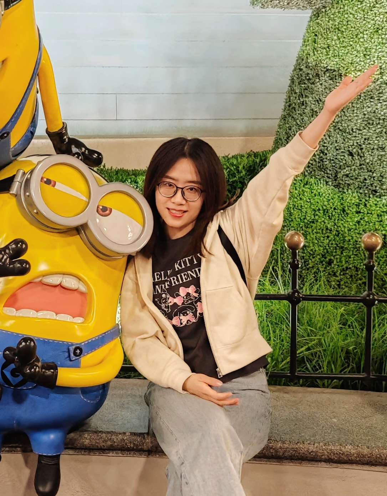
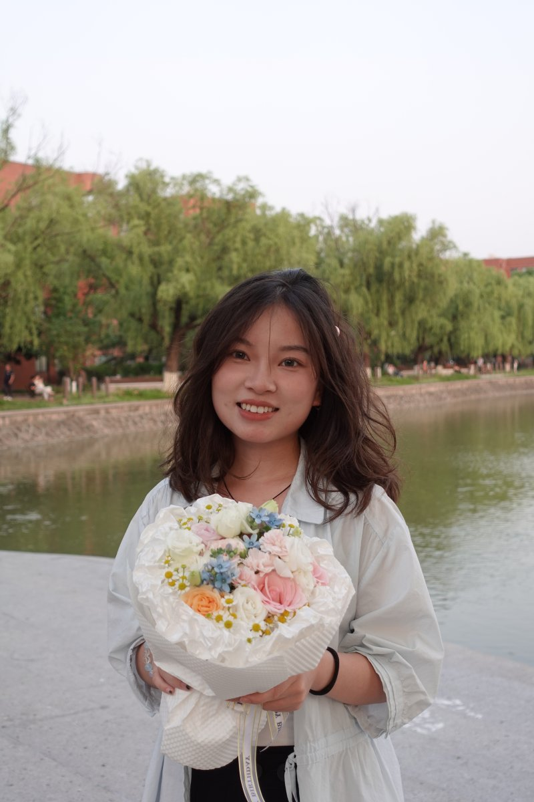
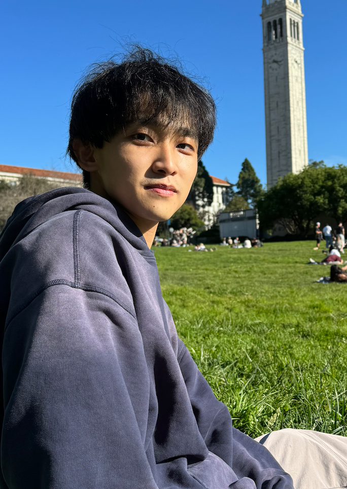
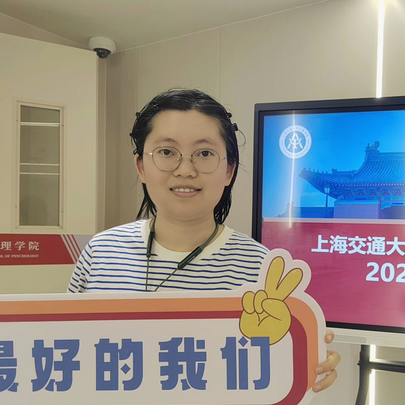
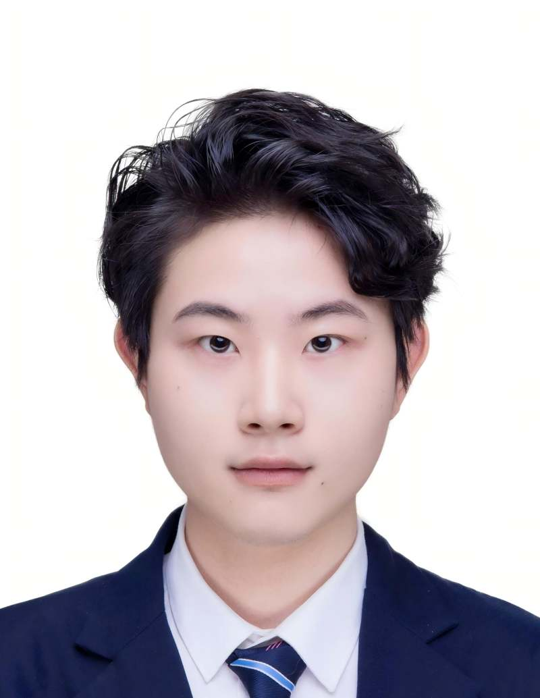

Visit the [PI page](pi.md) for details about the Principal Investigator.

### Faculty-Research Scientist
::: {.member-grid}
::: {.member-card}
{.member-avatar alt="Shaoling Zhao"}
Shaoling Zhao, PhD

<a href="mailto:zhaoshaoling@shsmu.edu.cn">zhaoshaoling@shsmu.edu.cn</a>

Faculty-Research Scientist · interested in neurodevelopment, personalized functional network topography and computational psychiatry

:::
:::

### PhD Students
::: {.member-grid}
::: {.member-card}
{.member-avatar alt="Quanhao Yu"}
Quanhao Yu

<a href="mailto:yqh847438584@126.com">yqh847438584@126.com</a>

PhD Student · interested in reward process

:::
::: {.member-card}
{.member-avatar alt="Xinyuan Zhang"}
Xinyuan Zhang

<a href="mailto:xinyuanz11@163.com">xinyuanz11@163.com</a>

PhD Student · interested in mechanism of addiction and neuromodulation

:::
::: {.member-card}
{.member-avatar alt="Yihan Yan"}
Yihan Yan

<a href="mailto:y9946h@sjtu.edu.cn">y9946h@sjtu.edu.cn</a>

PhD Student · interested in large-scale brain network analysis

:::
::: {.member-card}
{.member-avatar alt="Mengting (Vicky) Shen"}
Mengting (Vicky) Shen

<a href="mailto:smt15258410298@163.com">smt15258410298@163.com</a>

PhD Student · interested in using electroencephalography to explore the neural mechanisms underlying the functional decline in the elderly

:::
::: {.member-card}
{.member-avatar alt="Xinyi (Kathryn) Zhou"}
Xinyi (Kathryn) Zhou

<a href="mailto:kkkathryn@sjtu.edu.cn">kkkathryn@sjtu.edu.cn</a>

PhD Student · interested in using non-invasive brain stimulation (e.g., TMS/tDCS) and neuroimaging to investigate the neural mechanisms of cognitive impairment in individuals with addiction

:::
:::

### Master Students
::: {.member-grid}
::: {.member-card}
{.member-avatar alt="Yutong Li"}
Yutong Li

<a href="mailto:yutongli@sjtu.edu.cn">yutongli@sjtu.edu.cn</a>

Master Student · interested in computational psychiatry

:::
::: {.member-card}
{.member-avatar alt="Keyi Zhang"}
Keyi Zhang

<a href="mailto:kevinzhangkeyi@gmail.com">kevinzhangkeyi@gmail.com</a>

Master Student · interested in time perception

:::
::: {.member-card}
{.member-avatar alt="Yuqiao Cai"}
Yuqiao Cai

<a href="mailto:caiyq2025@sjtu.edu.cn">caiyq2025@sjtu.edu.cn</a>

Master Student · interested in the role of metacognition in decision making

<!-- Add members here using the same card template -->

### Interns
<!-- Add members here using the same card template -->

### Alumni
::: {.member-grid}
::: {.member-card}
{.member-avatar alt="Zhenhua Cui"}
Zhenhua Cui
<!--div class="member-email"><a href="mailto:REPLACE_WITH_EMAIL">[填写邮箱]</a></div-->

Alumni · former Research Assistant; now postgraduate student in psychology and neuroscience at KCL

:::
:::
