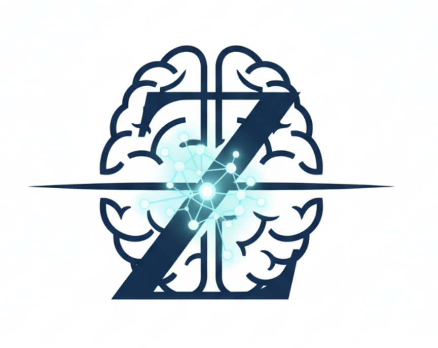

# 赵迪课题组 | 心智谱系研究组

## 研究方向

### 核心问题：  
#### 认知机制与连接组引导的干预
本课题组聚焦精神障碍与成瘾行为的认知神经机制，并重视全生命周期的临床转化。我们关注关键维度，如时间知觉、奖赏加工与决策的神经环路，为理解复杂心理病理提供基础。尤其重视青少年发展性心理病理学，描绘风险与韧性的神经发育轨迹，探索情绪失调与物质使用共病等关键问题的早期干预。

### 研究方法：  
#### 高维解码与 AI 驱动建模
我们采用严谨的数据科学与环路级精确建模。通过对多模态神经信号（如 SEEG、EEG、MEG、fMRI）的高级解码，并结合大语言模型（LLMs）与大多模态模型（LMMs），构建脑功能表征与行为之间的因果联系，为生物标志物驱动的治疗策略（如 TMS、tES、Ti）提供依据，促进复杂数据向临床可用洞见的转化。

### 转化目标：  
#### 面向环路的神经调控
我们的最终目标是实现高效、精准的治疗干预。我们采用外源性神经调控（包括闭环非侵入性脑刺激 NIBS），对异常神经环路进行功能性重构；在临床与老龄群体中开展环路靶向的神经调控研究，如基于前额叶—纹状体通路的认知增强。通过将精准生物标志物识别与闭环干预相连接，探索成瘾与其他精神障碍的新的治疗范式。

[了解我们的团队](people.html)  
[加入我们](contact.html)

