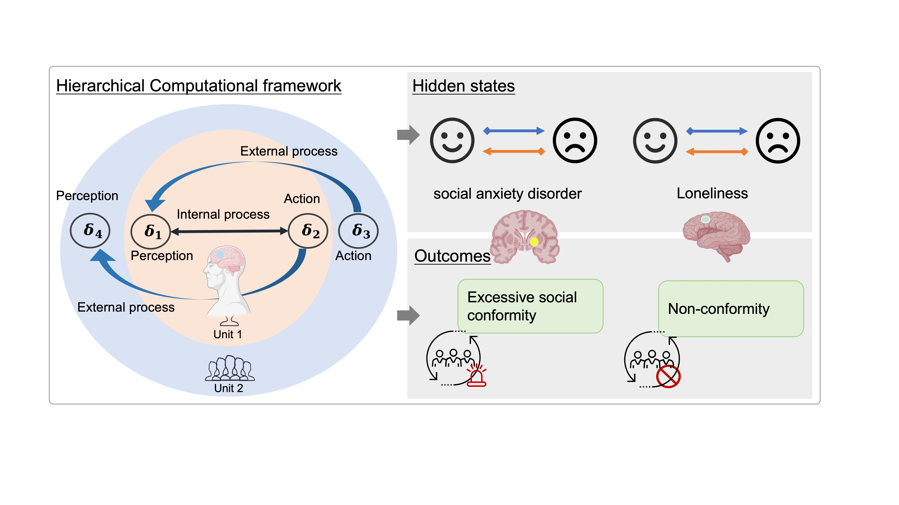
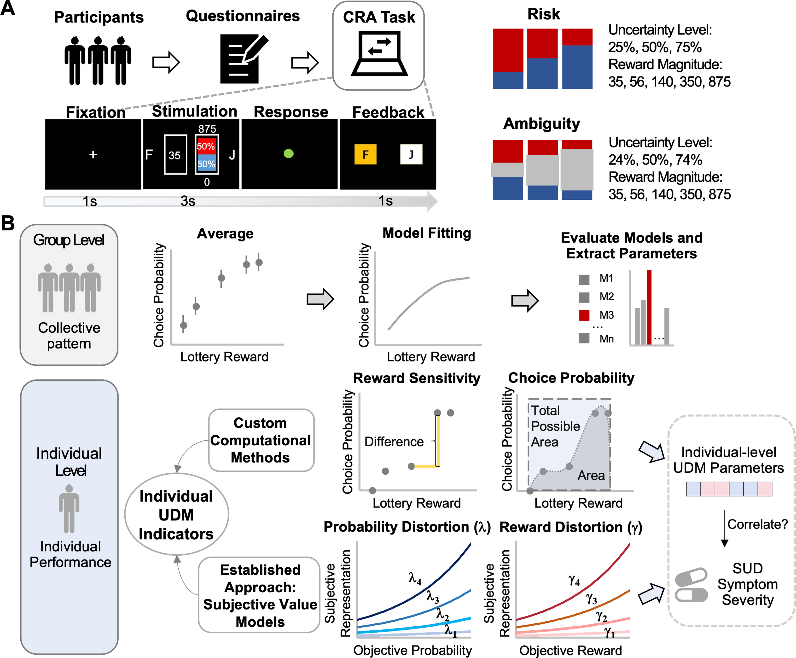
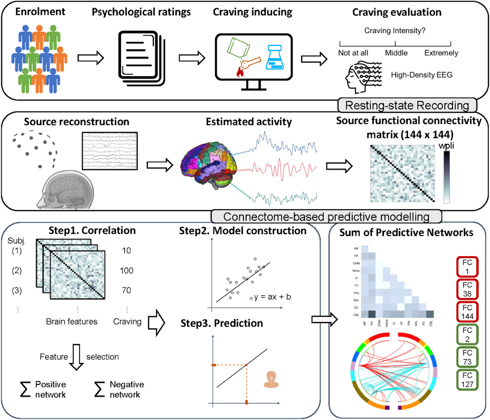

::: {.news-list}
::: {.news-item}
{.news-thumb alt="新闻配图1" style="width:240px; float:right; margin:0 0 1rem 1rem"}
出版  
动态：我们最新的荟萃分析发表在 Neuroscience & Biobehavioral Reviews，显示非侵入性脑刺激可同时降低自杀意念与抑郁症状，揭示协同效应与文化影响，提示 NIBS 是具有文化敏感性的潜在干预方式。  
[阅读全文](https://doi.org/10.1016/j.neubiorev.2025.106299){.btn .btn-sm .btn-primary target="_blank" rel="noopener"}
:::

::: {.news-item}
{.news-thumb alt="新闻配图2" style="width:240px; float:right; margin:0 0 1rem 1rem"}
出版  
动态：我们在 Biological Psychiatry 发表的研究揭示社会从众与精神障碍的重叠神经环路。基于分层计算框架，我们展示异常神经生物学如何塑造从众行为，并为药物治疗与神经刺激等个体化干预提供新靶点。  
[阅读全文](https://doi.org/10.1016/j.biopsych.2025.05.011){.btn .btn-sm .btn-primary target="_blank" rel="noopener"}
:::

::: {.news-item}
{.news-thumb alt="新闻配图3" style="width:240px; float:right; margin:0 0 1rem 1rem"}
出版  
动态：我们在 Biological Psychiatry: Cognitive Neuroscience and Neuroimaging 发表的行为建模研究，揭示不同物质使用障碍的决策不确定性特征差异。甲基苯丙胺使用者表现出更高的奖赏敏感性与对模糊性的灵活反应，与酒精使用者不同，强调了障碍特异机制与精准干预需求。  
[阅读全文](https://doi.org/10.1016/j.bpsc.2025.08.008){.btn .btn-sm .btn-primary target="_blank" rel="noopener"}
:::

::: {.news-item}
{.news-thumb alt="新闻配图4" style="width:240px; float:right; margin:0 0 1rem 1rem"}
出版  
动态：我们在 General Psychiatry 发表的临床研究表明，不良家庭环境显著加剧 ADHD 核心症状与对立违抗行为，提示需尽早开展针对家庭动力的个体化干预，以降低未治疗儿童的行为风险。  
[阅读全文](https://pubmed.ncbi.nlm.nih.gov/?term=Association+between+adverse+home+environments+and+symptoms+in+drug-naive+children+with+attention-deficit%2Fhyperactivity+disorder){.btn .btn-sm .btn-primary target="_blank" rel="noopener"}
:::

::: {.news-item}
{.news-thumb alt="新闻配图5" style="width:240px; float:right; margin:0 0 1rem 1rem"}
出版  
动态：我们在 International Journal of Clinical and Health Psychology 发表的连接组分析识别出能预测甲基苯丙胺渴求的 EEG 特异网络。该 β 频段连接组关联戒断时长、冲动性与线索诱发渴求，为精准干预提供新靶点。  
[阅读全文](https://doi.org/10.1016/j.ijchp.2025.100551){.btn .btn-sm .btn-primary target="_blank" rel="noopener"}
:::
:::
