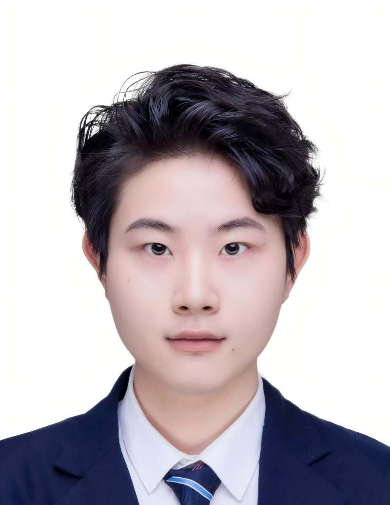

访问 [首席研究员 页面](../zh/pi.md) 了解课题组负责人详情。

### 博士研究生

::: {.member-grid}
::: {.member-card}
{.member-avatar alt="于权浩"}
于权浩

博士研究生 · 研究兴趣：奖励加工

:::
::: {.member-card}
{.member-avatar alt="张馨元"}
张馨元

博士研究生 · 研究兴趣：成瘾机制与神经调控

:::
:::

### 科研助理 / 技术员

<!-- 按照同样的卡片模板添加成员 -->

### 实习生

<!-- 按照同样的卡片模板添加成员 -->

### 校友

::: {.member-grid}
::: {.member-card}
{.member-avatar alt="崔振华"}
崔振华

校友 · 前科研助理；现 KCL 心理与神经科学研究生

:::
:::
